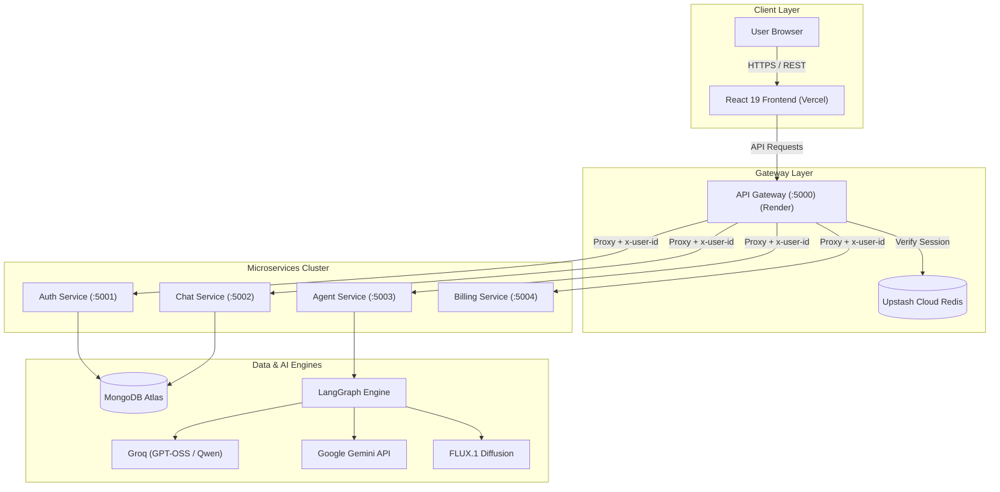

# 🧠 AuraMind AI — Distributed Multi-Agent AI Platform

[](https://aura-mind-ai-multi-agent-ai-platfor-smoky.vercel.app)
[](https://auramind-ai-multi-agent-ai-platform-1.onrender.com)
[](LICENSE)
[](https://github.com/nirmal168)

> **Author**: **Nirmal Prajapat** ([@nirmal168](https://github.com/nirmal168))  
> 🌐 **Live Web Application**: [https://aura-mind-ai-multi-agent-ai-platfor-smoky.vercel.app](https://aura-mind-ai-multi-agent-ai-platfor-smoky.vercel.app)  
> 🚪 **Live API Gateway**: [https://auramind-ai-multi-agent-ai-platform-1.onrender.com](https://auramind-ai-multi-agent-ai-platform-1.onrender.com)  

---

## 📖 Overview

**AuraMind AI** is an enterprise-grade, distributed multi-agent AI workspace built on a Microservices architecture. It dynamically routes user requests across specialized autonomous AI agents, including interactive coding sandboxes, real-time web search, PowerPoint generation, PDF synthesis, and studio-grade image creation.

---

## ✨ Key Features

- 🤖 **Autonomous Multi-Agent Routing**: Powered by **LangGraph**, incoming prompts are classified and routed to the optimal specialized AI agent.
- 🎨 **Qwen Image Engine & FLUX.1 Realism**: Generates 8K commercial studio photography, authentic public figure photos, and 3D Pixar-style renders.
- 📊 **Executive PowerPoint Generator (.pptx)**: Generates 16:9 widescreen executive decks matching Microsoft PowerPoint OpenXML standards with direct binary streaming.
- 📄 **PDF Report & Document Agent**: Compiles structured documents and summaries ready for one-click download.
- 💻 **Interactive Code Sandbox & Artifacts**: Generates multi-file codebases (HTML/CSS/JS) with live in-browser preview powered by Monaco Editor.
- 🌐 **Real-Time Web Search**: Synthesizes live web information using search intelligence.
- 🔐 **Secure Distributed Authentication**: Session-based auth with Google OAuth, Upstash Cloud Redis session cache, and MongoDB Atlas persistence.

---

## 🏛️ System Architecture



---

## 🛠️ Technology Stack

| Layer | Technologies |
| :--- | :--- |
| **Frontend** | React 19, Vite, Tailwind CSS, Redux Toolkit, Monaco Editor, Lucide Icons |
| **Gateway & Microservices** | Node.js, Express, `express-http-proxy`, `cookie-parser`, `ioredis` |
| **AI & Orchestration** | LangGraph, LangChain, Groq LLMs (`qwen/qwen3.6-27b`, `openai/gpt-oss-20b`), Google Gemini |
| **Databases & Cache** | MongoDB Atlas, Upstash Cloud Redis |
| **Document Engines** | `pptxgenjs`, `pdfkit`, `pdf-parse` |
| **Deployment** | Vercel (Frontend), Render (Microservices & Gateway) |

---

## 🚀 Microservices Breakdown

| Service | Port | Description |
| :--- | :---: | :--- |
| **API Gateway** | `5000` | Central entry point, CORS, session verification, dynamic header propagation (`x-user-id`), and binary file stream proxy |
| **Auth Service** | `5001` | Firebase Google OAuth verification, user profile lifecycle, and credit allocation |
| **Chat Service** | `5002` | MongoDB conversation threads, message histories, and project metadata |
| **Agent Service** | `5003` | LangGraph DAG multi-agent brain, Qwen image studio, PowerPoint & PDF generation |
| **Billing Service**| `5004` | Razorpay order creation and subscription management |

---

## 💻 Local Development Setup

### Prerequisites
- Node.js `>= 20.x`
- MongoDB (Atlas or Local)
- Redis (Upstash or Local)

### 1. Clone the Repository
```bash
git clone https://github.com/nirmal168/AuraMind-AI-multi-agent-ai-platform-.git
cd AuraMind-AI-multi-agent-ai-platform-
```

### 2. Install Dependencies & Start Backend Services
```bash
# Gateway
cd backend/gateway && npm install && npm run dev

# Agent Service
cd ../services/agent && npm install && npm run dev

# Auth Service
cd ../services/auth && npm install && npm run dev

# Chat Service
cd ../services/chat && npm install && npm run dev
```

### 3. Start Frontend
```bash
cd ../../../frontend
npm install
npm run dev
```
Open **`http://localhost:5174`** in your browser.

---

## 🔑 Environment Variables

### Gateway (`backend/gateway/.env`)
```env
PORT=5000
FRONTEND_URL=https://aura-mind-ai-multi-agent-ai-platfor-smoky.vercel.app
AUTH_SERVICE=https://auramind-auth.onrender.com
CHAT_SERVICE=https://auramind-chat.onrender.com
AGENT_SERVICE=https://auramind-agent.onrender.com
BILLING_SERVICE=https://auramind-billing.onrender.com
REDIS_URL=rediss://default:<password>@<upstash-endpoint>:6379
```

### Agent Service (`backend/services/agent/.env`)
```env
PORT=5003
GROQ_API_KEY=gsk_...
GEMINI_API_KEY=AQ...
GATEWAY_URL=https://auramind-ai-multi-agent-ai-platform-1.onrender.com
CHAT_SERVICE=https://auramind-chat.onrender.com
AUTH_SERVICE=https://auramind-auth.onrender.com
REDIS_URL=rediss://default:<password>@<upstash-endpoint>:6379
```

### Frontend (`frontend/.env`)
```env
VITE_SERVER_URL=https://auramind-ai-multi-agent-ai-platform-1.onrender.com
VITE_FIREBASE_API_KEY=...
VITE_FIREBASE_AUTH_DOMAIN=...
VITE_FIREBASE_PROJECT_ID=...
```

---
## 👨‍💻 Author & License

Designed and developed with ❤️ by **Nirmal Prajapat**.

- 💻 **GitHub**: [@nirmal168](https://github.com/nirmal168)
- 🌐 **Live Web App**: [AuraMind AI on Vercel](https://aura-mind-ai-multi-agent-ai-platfor-smoky.vercel.app)
- 📜 **License**: ISC License
