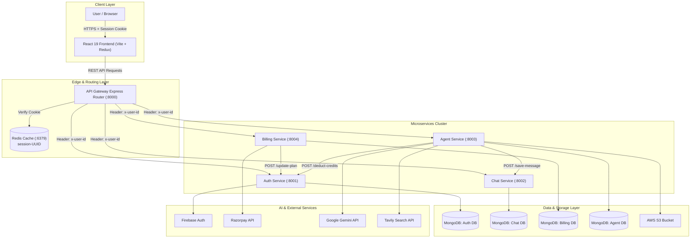
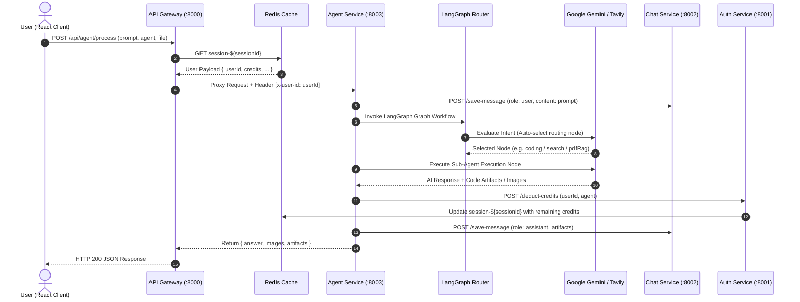
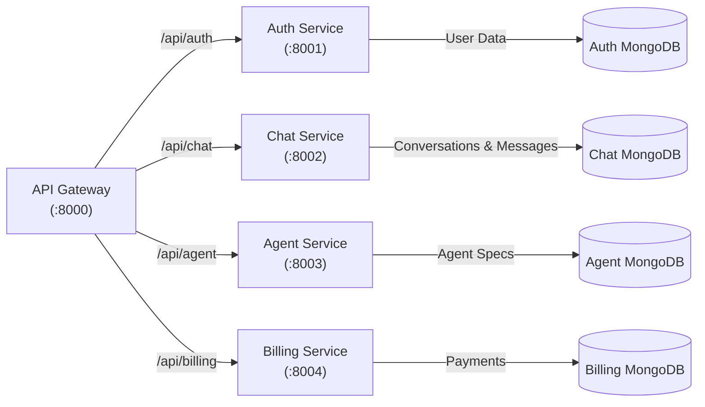
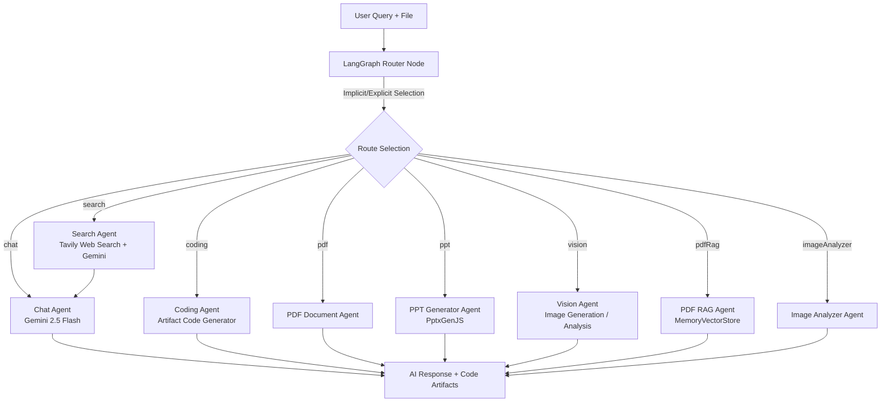
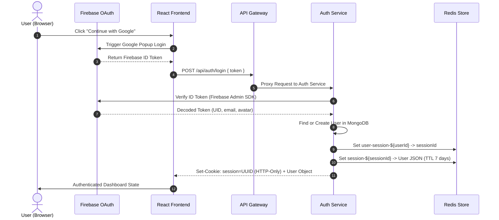
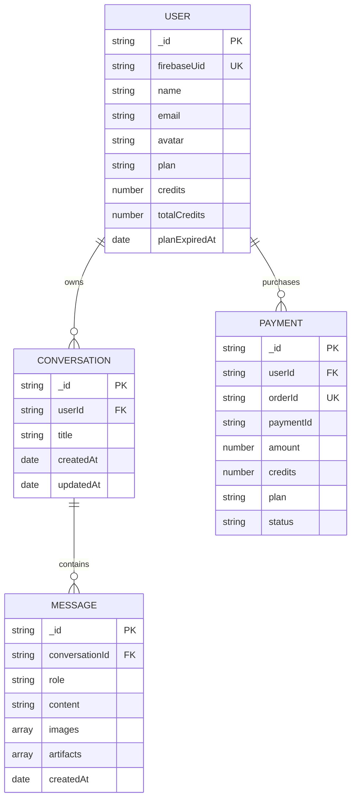
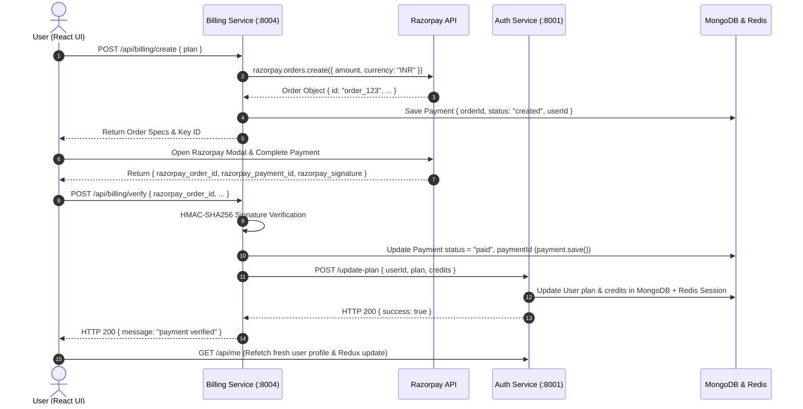
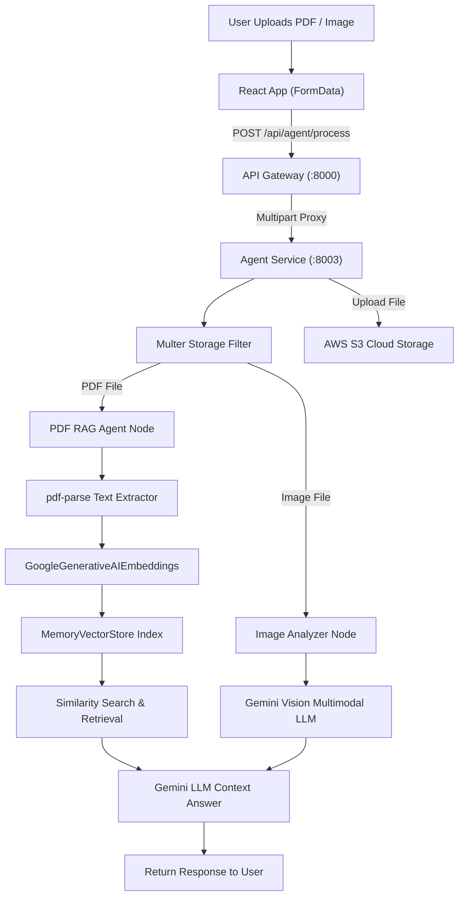
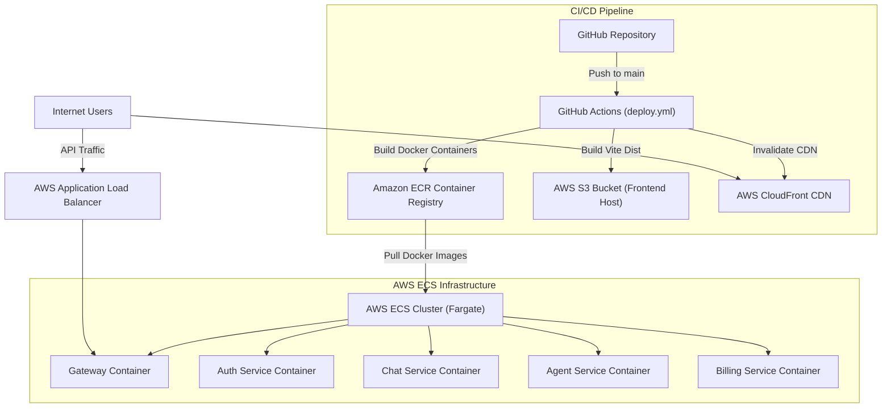

# AuraMind AI Platform — Enterprise Multi-Agent AI Architecture

> **Author**: **Nirmal Prajapat** ([GitHub @nirmal168](https://github.com/nirmal168))  
> 🌐 **Live Web App**: [https://aura-mind-ai-multi-agent-ai-platfor-smoky.vercel.app](https://aura-mind-ai-multi-agent-ai-platfor-smoky.vercel.app)  
> 🚪 **Live API Gateway**: [https://auramind-ai-multi-agent-ai-platform-1.onrender.com](https://auramind-ai-multi-agent-ai-platform-1.onrender.com)  

An enterprise-grade, distributed AI platform built on a Microservices architecture. AuraMind AI features an API Gateway reverse-proxy pattern, Firebase & Upstash Redis session authentication, a **LangGraph** multi-agent state graph orchestration engine, automated PDF RAG indexing, PowerPoint (.pptx) generator, Qwen & FLUX.1 8K image generation studio, code execution artifacts via Monaco Editor, Razorpay billing integration, and full production deployment on Vercel & Render.

---

## Table of Contents

- [1. Project Overview](#1-project-overview)
- [2. Technology Stack](#2-technology-stack)
- [3. System Architecture](#3-system-architecture)
- [4. High-Level System Architecture Diagram](#4-high-level-system-architecture-diagram)
- [5. System Flow](#5-system-flow)
- [6. System Flow Diagram](#6-system-flow-diagram)
- [7. Microservices Architecture](#7-microservices-architecture)
- [8. AI / Multi-Agent Architecture](#8-ai--multi-agent-architecture)
- [9. Authentication Flow](#9-authentication-flow)
- [10. Database Architecture](#10-database-architecture)
- [11. Billing / Payment Flow](#11-billing--payment-flow)
- [12. File & Storage RAG Flow](#12-file--storage-rag-flow)
- [13. Deployment Architecture](#13-deployment-architecture)
- [14. Security Architecture & Audit](#14-security-architecture--audit)
- [15. Scalability Analysis](#15-scalability-analysis)
- [16. Project Structure](#16-project-structure)
- [17. Feature List](#17-feature-list)
- [18. API Architecture](#18-api-architecture)
- [19. Local Development](#19-local-development)
- [20. Environment Variables](#20-environment-variables)
- [21. System Design Summary](#21-system-design-summary)
- [22. Architectural Risks](#22-architectural-risks)
- [23. Future Improvements](#23-future-improvements)

---

## 1. Project Overview

### Problem Solved
Traditional AI chat applications are monolithic single-prompt wrappers. AuraMind AI solves complex developer and enterprise workflows by routing incoming queries dynamically to specialized, autonomous AI agents (Coding, Web Search, PDF RAG, Image Vision, PPT Generation) while managing distributed user session state, credit balances, and payment plans.

### Key Capabilities
- **Multi-Agent Routing**: Autonomous LangGraph router that inspects prompt intent and file attachments to dispatch to the optimal AI agent.
- **Artifacts Engine**: Live in-browser HTML/CSS/JS execution and preview powered by Monaco Editor.
- **Document & Vision RAG**: Instant PDF vector embedding indexing (`MemoryVectorStore`) and vision-based image analysis.
- **Credit & Subscription Engine**: Usage-based credit deductions per agent invocation with Razorpay payment processing.
- **Distributed Microservice Gateway**: Centralized API Gateway enforcing Redis session security and user-ID header propagation (`x-user-id`).

---

## 2. Technology Stack

### Frontend

| Technology | Purpose | Location |
| :--- | :--- | :--- |
| **React 19** | Modern UI Component Library | `frontend/src` |
| **Vite 8** | Fast frontend build tool and dev server | `frontend/vite.config.js` |
| **Tailwind CSS v4** | Utility-first CSS styling engine | `frontend/src/index.css` |
| **Redux Toolkit** | Centralized client state (User, Messages, Conversations, Artifacts) | `frontend/src/redux/*` |
| **Monaco Editor** | In-browser code editing for AI-generated code artifacts | `frontend/src/components/Artifact.jsx` |
| **Motion** | Fluid animations and drawer transitions | `frontend/src/components/*` |
| **Firebase SDK** | Client-side Google OAuth popup authentication | `frontend/utils/firebase.js` |
| **Axios** | HTTP client configured with CORS credentials | `frontend/utils/axios.js` |
| **Lucide React** | UI icon library | `frontend/src/components/*` |

### Backend

| Technology | Purpose | Location |
| :--- | :--- | :--- |
| **Node.js / Express** | Microservice HTTP application runtime | All `backend/services/*` and `backend/gateway` |
| **express-http-proxy** | Reverse proxy router with dynamic header injection | `backend/gateway/utils/proxyWithHeader.js` |
| **Firebase Admin SDK** | Server-side authentication token verification | `backend/services/auth/config/firebase.js` |
| **ioredis** | Distributed Redis caching client | `backend/shared/redis/redis.js` |
| **Mongoose** | MongoDB Object Data Modeling (ODM) | `auth`, `chat`, `billing`, `agent` models |
| **Razorpay Node SDK** | Payment order creation & webhook signature verification | `backend/services/billing/config/razorpay.js` |
| **PptxGenJS & PDFKit** | Automated slide deck and PDF report generation | `backend/services/agent/utils/*` |

### Database

| Technology | Purpose | Location |
| :--- | :--- | :--- |
| **MongoDB Atlas** | Document storage for Users, Conversations, Messages, and Payments | Service database configs |
| **Redis** | Distributed user session cache & conversation memory | `backend/shared/redis/redis.js` |

### AI / GenAI

| Technology | Purpose | Location |
| :--- | :--- | :--- |
| **LangGraph** | Directed Acyclic Graph (DAG) state machine for multi-agent workflows | `backend/services/agent/graph/graph.js` |
| **LangChain Core** | Unified LLM abstraction and prompt templates | `backend/services/agent/config/llmModels.js` |
| **Google Gemini (2.5 & 1.5)** | Primary LLM provider for reasoning, coding, vision, and RAG | `backend/services/agent/config/llmModels.js` |
| **Tavily Search AI** | Real-time web search agent capability | `backend/services/agent/config/tavily.js` |
| **MemoryVectorStore** | In-memory RAG vector index for PDF context processing | `backend/services/agent/agents/pdfRag.agent.js` |

### Cloud / DevOps

| Technology | Purpose | Location |
| :--- | :--- | :--- |
| **Docker & Docker Compose**| Multi-container local virtualization | `docker-compose.yml`, Service `Dockerfile`s |
| **GitHub Actions** | Automated CI/CD deployment pipeline | `.github/workflows/deploy.yml` |
| **AWS ECR & ECS (Fargate)** | Container registry and container orchestration cluster | `.github/workflows/deploy.yml` |
| **AWS S3 & CloudFront** | Static frontend hosting & CDN distribution | `.github/workflows/deploy.yml` |

---

## 3. System Architecture

The AuraMind AI Platform implements a **Microservices Architecture with an API Gateway**. Downstream services are fully isolated by domain concern and communicate via internal REST APIs and shared Redis session state.

### Core Architectural Layers:
1. **Client Layer**: Single Page Application (React 19) rendering chat interface, code editor artifacts, agent selection, and billing drawers.
2. **API Gateway Layer (`:8000`)**: Single entry point that intercepts HTTP requests, verifies HTTP-only `session` cookies against Redis, and decorates downstream proxy requests with the `x-user-id` header.
3. **Auth Microservice (`:8001`)**: Verifies Firebase ID tokens, manages MongoDB user documents, maintains 7-day Redis session keys, and updates credit/subscription balances.
4. **Chat Microservice (`:8002`)**: Stores conversation metadata and full message history threads in MongoDB.
5. **Agent Microservice (`:8003`)**: Runs the **LangGraph** workflow engine, routes user queries to specialized sub-agents, interacts with LLM providers (Gemini), updates credit balances, and uploads generated files to AWS S3.
6. **Billing Microservice (`:8004`)**: Handles Razorpay checkout order generation, HMAC-SHA256 signature verification, and notifies Auth Service upon payment completion.

---

## 4. High-Level System Architecture Diagram



---

## 5. System Flow

```text
User Action (Send Prompt / Upload File)
 ↓
React Frontend (Dispatches Redux Action & Calls Axios API)
 ↓
API Gateway (:8000)
 ↓
Auth Middleware (Reads 'session' Cookie -> Queries Redis -> Injects 'x-user-id' Header)
 ↓
Agent Service (:8003)
 ↓
Save User Message (POST to Chat Service :8002)
 ↓
LangGraph Engine (graph.js -> router.js)
 ↓
Sub-Agent Execution (Chat / Coding / Search / PDF RAG / PPT / Vision)
 ↓
External Call (Google Gemini LLM / Tavily Web Search / AWS S3)
 ↓
Deduct User Credits (POST to Auth Service :8001 -> Updates Redis Session)
 ↓
Save Assistant Message & Artifacts (POST to Chat Service :8002)
 ↓
Return JSON Response to Frontend
 ↓
React UI Updates State & Smooth-Scrolls to Output
```

---

## 6. System Flow Diagram



---

## 7. Microservices Architecture



### Microservice Directory & Specification

| Service | Port | Primary Responsibility | Target Database | Dependencies |
| :--- | :---: | :--- | :--- | :--- |
| **API Gateway** | `8000` | Session validation, CORS, reverse proxy routing, user header injection | Redis (`:6379`) | `express-http-proxy`, `cookie-parser` |
| **Auth Service** | `8001` | Firebase token verification, User CRUD, session management, plan/credit updates | MongoDB (`auth`) | `firebase-admin`, `ioredis` |
| **Chat Service** | `8002` | Conversation threads & message history management | MongoDB (`chat`) | `mongoose` |
| **Agent Service** | `8003` | LangGraph DAG execution, LLM calls, RAG embedding, artifact generation | MongoDB (`agent`) | `@langchain/langgraph`, Gemini, Tavily, AWS S3 |
| **Billing Service** | `8004` | Order generation, Razorpay webhook signature verification | MongoDB (`billing`) | `razorpay`, `crypto`, Auth Service |

---

## 8. AI / Multi-Agent Architecture

The Agent Service uses **LangGraph** to build a stateful Directed Acyclic Graph (DAG) for processing user requests.



### Available Agents Specification:
- **Chat Agent**: Handles general inquiries, conversation history, and basic markdown text.
- **Search Agent**: Executes real-time web searches using Tavily API, formats search context, and routes to Chat Agent.
- **Coding Agent**: Generates multi-file code artifacts (HTML, CSS, JS, React) rendered in the frontend Monaco Editor.
- **PDF RAG Agent**: Indexes uploaded PDF files using `MemoryVectorStore` and performs semantic retrieval-augmented generation.
- **PPT Agent**: Converts prompts into structured PowerPoint presentations using `pptxgenjs`.
- **Vision Agent**: Performs multimodal image prompt generation and analysis.

---

## 9. Authentication Flow



---

## 10. Database Architecture



---

## 11. Billing / Payment Flow



---

## 12. File & Storage RAG Flow



---

## 13. Deployment Architecture



---

## 14. Security Architecture & Audit

### Security Implementations:
- **Centralized Auth Guard**: The Gateway intercepts requests, validates HTTP-only Redis cookies, and strip/injects identity headers (`x-user-id`).
- **HMAC Signature Verification**: Razorpay verification uses `crypto.createHmac('sha256')` against key secret.
- **Environment Isolation**: `.env` patterns excluded via root `.gitignore`.

### Security Risk Audit Findings

| Severity | Category | Vulnerability Description |
| :---: | :--- | :--- |
| 🔴 **Critical** | **Hardcoded Service Secrets** | `serviceAccountKey.json` contained committed GCP credentials (resolved via `.gitignore` and git purge). |
| 🟠 **High** | **No Gateway Rate Limiting** | Gateway lacks `express-rate-limit`, exposing endpoints to brute force attempts. |
| 🟡 **Medium** | **CORS Scope** | Gateway CORS relies on runtime `.env` setting; requires strict domain lockdown in production. |
| 🟡 **Medium** | **Missing Schema Sanitization** | Controller inputs destructure `req.body` directly without `zod` validation middleware. |

---

## 15. Scalability Analysis

| Traffic Volume | Architecture Behavior | Potential Bottlenecks |
| :--- | :--- | :--- |
| **100 Concurrent Users** | 🟢 Optimal Performance (<200ms gateway latency) | None |
| **1,000 Concurrent Users** | 🟡 Acceptable | Synchronous HTTP calls (`Agent` $\rightarrow$ `Chat` / `Auth`) |
| **10,000 Concurrent Users** | 🔴 Stress Limits | Gateway CPU overhead & LLM provider rate limits (429) |
| **100,000+ Concurrent Users**| 🔴 Requires Refactoring | Requires RabbitMQ message broker & persistent Vector DB |

---

## 16. Project Structure

```text
AuraMind-AI/
├── .github/
│   └── workflows/
│       └── deploy.yml              # GitHub Actions AWS Deployment Workflow
├── backend/
│   ├── docker-compose.yml          # Multi-container orchestration
│   ├── gateway/                    # API Gateway Service (:8000)
│   │   ├── controllers/
│   │   ├── middleware/
│   │   ├── utils/
│   │   └── index.js
│   ├── shared/
│   │   └── redis/
│   │       └── redis.js            # Shared Redis connection module
│   └── services/
│       ├── agent/                  # LangGraph Multi-Agent Engine (:8003)
│       │   ├── agents/             # Sub-agents (chat, coding, search, pdf, ppt, vision)
│       │   ├── config/             # LLM, Vector Store, Memory, S3, Tavily
│       │   ├── controllers/
│       │   ├── graph/              # LangGraph graph.js, router.js, state.js
│       │   ├── routes/
│       │   └── utils/
│       ├── auth/                   # Authentication Service (:8001)
│       ├── billing/                # Billing Service (:8004)
│       └── chat/                   # Conversation & Message Service (:8002)
├── frontend/                       # Vite + React 19 Frontend
│   ├── src/
│   │   ├── components/             # SideBar, Artifact, ChatInput, MessageList, Nav
│   │   ├── features/               # API feature helpers
│   │   ├── pages/                  # Home Page
│   │   └── redux/                  # Redux Toolkit Slices
│   ├── utils/                      # Axios & Firebase instances
│   └── vite.config.js
└── .gitignore
```

---

## 17. Feature List

### ✅ Implemented
- [x] Firebase Google Popup Authentication
- [x] API Gateway Reverse Proxy with Cookie-to-Header (`x-user-id`) injection
- [x] Redis Session Storage (7-day TTL)
- [x] LangGraph Multi-Agent Orchestration Engine
- [x] Real-time Tavily Web Search integration
- [x] PDF Document RAG with `MemoryVectorStore`
- [x] Artifact Code Execution & Live HTML/CSS Preview via Monaco Editor
- [x] Razorpay Order Creation & HMAC Verification
- [x] Usage Credit Deduction & Subscription Plan Tracking
- [x] Continuous AI Status Loading Animation (Generating $\rightarrow$ Reasoning $\rightarrow$ Searching)
- [x] Auto-Scrolling Chat Thread
- [x] Automated AWS Deployment (ECR / ECS / S3 / CloudFront) via GitHub Actions

### ⚠️ Partially Implemented
- [!] **In-Memory Vector Store**: PDF embeddings reside in memory (`MemoryVectorStore`) and do not persist across container restarts.

### ❌ Not Implemented
- [-] Token-by-token streaming via WebSockets or Server-Sent Events (SSE).
- [-] Asynchronous message queue (RabbitMQ / Kafka) for background task queueing.

---

## 18. API Architecture

| Service | Method | Endpoint | Auth Required | Purpose |
| :--- | :---: | :--- | :---: | :--- |
| **Gateway / Auth** | `POST` | `/api/auth/login` | No | Verify Firebase token & create session |
| **Gateway / Auth** | `GET` | `/api/auth/logout` | Yes | Destroy Redis session & clear cookies |
| **Gateway** | `GET` | `/api/me` | Yes | Get authenticated user profile & credit balance |
| **Gateway / Chat** | `GET` | `/api/chat/conversations` | Yes | List user conversation history |
| **Gateway / Chat** | `POST` | `/api/chat/create` | Yes | Create a new conversation thread |
| **Gateway / Chat** | `GET` | `/api/chat/messages/:id` | Yes | Fetch messages for specific conversation |
| **Gateway / Agent** | `POST` | `/api/agent/process` | Yes | Process user prompt through LangGraph multi-agent engine |
| **Gateway / Billing**| `POST` | `/api/billing/create` | Yes | Create Razorpay payment order |
| **Gateway / Billing**| `POST` | `/api/billing/verify` | Yes | Verify Razorpay payment signature & update plan |

---

## 19. Local Development

### Prerequisites
- Node.js `>= 20.x`
- Docker & Docker Compose
- MongoDB Local or Atlas URI
- Redis (`localhost:6379`)

### Running Local Microservices with Docker Compose

```bash
# 1. Clone the repository
git clone https://github.com/Ravindraprajapat/Multi-Agent-AI-Platform.git
cd Multi-Agent-AI-Platform

# 2. Build and start backend microservices
cd backend
docker-compose up --build -d

# 3. Start Frontend application
cd ../frontend
npm install
npm run dev
```

The frontend will start at `http://localhost:5173` and communicate with the Gateway at `http://localhost:8000`.

---

## 20. Environment Variables

### Gateway Environment (`backend/gateway/.env`)
```env
PORT=8000
FRONTEND_URL=http://localhost:5173
AUTH_SERVICE=http://localhost:8001
CHAT_SERVICE=http://localhost:8002
AGENT_SERVICE=http://localhost:8003
BILLING_SERVICE=http://localhost:8004
REDIS_HOST=localhost
REDIS_PORT=6379
```

### Auth Service Environment (`backend/services/auth/.env`)
```env
PORT=8001
MONGO_URI=mongodb://localhost:27017/auth
REDIS_HOST=localhost
REDIS_PORT=6379
```

### Agent Service Environment (`backend/services/agent/.env`)
```env
PORT=8003
MONGO_URI=mongodb://localhost:27017/agent
GEMINI_API_KEY=your_gemini_key
TAVILY_API_KEY=your_tavily_key
AWS_ACCESS_KEY_ID=your_aws_key
AWS_SECRET_ACCESS_KEY=your_aws_secret
AWS_REGION=us-east-1
S3_BUCKET_NAME=your_bucket
CHAT_SERVICE=http://localhost:8002
AUTH_SERVICE=http://localhost:8001
```

### Billing Service Environment (`backend/services/billing/.env`)
```env
PORT=8004
MONGO_URI=mongodb://localhost:27017/billing
RAZORPAY_KEY_ID=your_razorpay_key_id
RAZORPAY_KEY_SECRET=your_razorpay_secret
AUTH_SERVICE=http://localhost:8001
```

---

## 21. System Design Summary

| Category | Rating | Justification |
| :--- | :---: | :--- |
| **Architecture** | `8.5 / 10` | Microservices API Gateway reverse proxy pattern with clear service separation. |
| **Scalability** | `7.0 / 10` | Stateless microservices allow ECS auto-scaling; HTTP inter-service calls limit extreme load. |
| **Reliability** | `7.5 / 10` | Robust controller error handling and agent routing fallbacks. |
| **Security** | `7.5 / 10` | Centralized Redis HTTP-only cookie validation and header propagation. |
| **Performance** | `8.0 / 10` | Fast gateway routing and optimized Vite production build. |
| **Maintainability**| `8.5 / 10` | Highly modular codebase structure with clear domain boundaries. |
| **Database Design**| `8.0 / 10` | Clean Mongoose models with explicit indexing and schema definitions. |
| **API Design** | `8.0 / 10` | Consistent REST API design across microservice endpoints. |
| **DevOps** | `9.0 / 10` | Comprehensive GitHub Actions workflow deploying to AWS ECR/ECS/S3/CloudFront. |
| **OVERALL** | **`8.3 / 10`** | **Production-Ready Enterprise AI SaaS Architecture** |

---

## 22. Architectural Risks

1. **Synchronous HTTP Service Chains**: Direct inter-service HTTP POST calls (`Agent` $\rightarrow$ `Chat`, `Agent` $\rightarrow$ `Auth`) can lead to HTTP socket exhaustion under heavy concurrent load.
2. **In-Memory Vector Search**: Storing document vectors in `MemoryVectorStore` restricts RAG scale and memory bounds.
3. **Lack of Token Streaming**: AI responses are returned as full JSON objects rather than real-time Server-Sent Events (SSE).

---

## 23. Future Improvements

| Priority | Recommendation | Current Situation | Expected Benefit |
| :---: | :--- | :--- | :--- |
| **P1** | **Server-Sent Events (SSE)** | Delivers full JSON payload after generation. | Instant token-by-token response streaming (<300ms time-to-first-token). |
| **P1** | **Pinecone / Qdrant Integration** | Uses `MemoryVectorStore` for PDF RAG. | Persistent, production-grade vector index supporting large files. |
| **P2** | **Message Queue (RabbitMQ)** | Microservices talk via direct HTTP calls. | Decouples inter-service communication and queues long tasks reliably. |
| **P2** | **Frontend Code-Splitting** | Single 1.33 MB JS bundle. | Lazy loads Monaco Editor to reduce initial JS load by >50%. |

---

## 24. Author & License

Developed and engineered with ❤️ by **Nirmal Prajapat**.

- 💻 **GitHub**: [@nirmal168](https://github.com/nirmal168)
- 🌐 **Live Web Application**: [AuraMind AI on Vercel](https://aura-mind-ai-multi-agent-ai-platfor-smoky.vercel.app)
- 📜 **License**: ISC License
